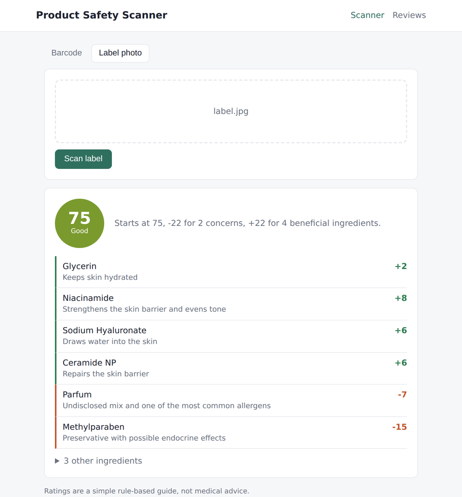
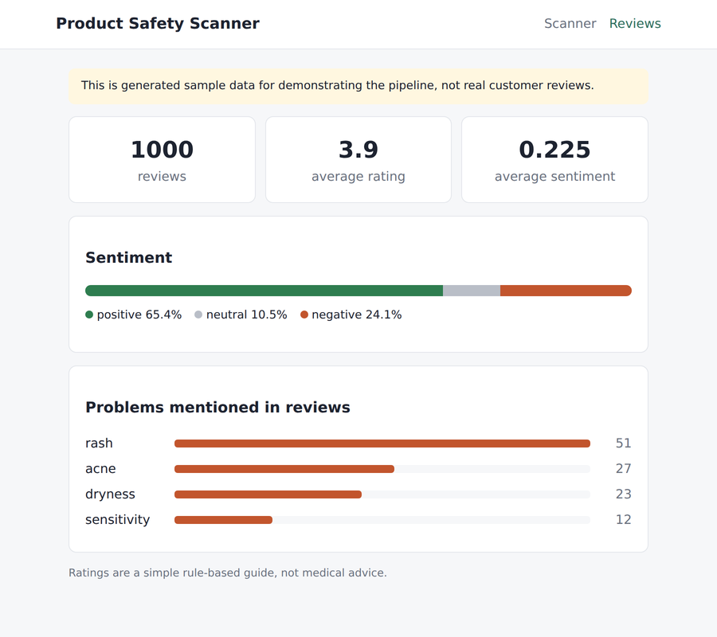

# Personal Care Product Safety Scanner

[](https://github.com/muhammad-dz/personal-care-product-scanner/actions/workflows/ci.yml)


Scan a skincare product by barcode or by photographing its ingredient list,
and get a 0–100 rating that explains exactly which ingredients moved the score
and why. There's also a small NLP dashboard that runs sentiment analysis over
product reviews and pulls out the problems people mention (rashes, breakouts,
dryness and so on).

<p>
  
  
</p>

## Why I built this

<!-- Write this in your own words: what made you want to build it, what you wanted to learn. -->

## How it works

```
barcode ──► Open Beauty Facts / Open Food Facts ──┐
                                                  ├──► ingredient list ──► scorer ──► score + breakdown
photo ────► Tesseract OCR ──► ingredient parser ──┘

reviews.csv ──► VADER sentiment + issue keywords ──► dashboard
```

**Barcode lookup** (`services/openbeautyfacts.py`) tries Open Beauty Facts
first and falls back to Open Food Facts, which also lists some toiletries.
Timeouts and upstream errors come back as a clear 502 instead of a crash.

**Label photos** (`services/ocr.py`) are converted to greyscale, upscaled
and contrast-stretched before going through Tesseract. The parser then finds
the "Ingredients:" heading (English, French, German or INCI), stops at things
like "Directions:", repairs words hyphenated across a line break and splits
the list.

**Scoring** (`services/scoring.py`, rules in `rules.py`):

- every product starts at **75**
- each flagged ingredient takes off **15 / 7 / 3** points for high / medium / low concern
- beneficial ingredients add points, capped at **+25** in total so a long list of actives can't hide a real problem
- the result is clamped to 0–100 and banded Excellent / Good / Moderate / Poor / Avoid

Each ingredient is matched once, against the first rule that fits. Matches
respect word boundaries, so *methylparaben* isn't also counted as
*ethylparaben*, and *cetearyl alcohol* (a harmless fatty alcohol) isn't
treated like drying *alcohol denat.* The API returns the base score, penalty
and bonus alongside the per-ingredient points, so the total can always be
checked by hand.

**Reviews** (`services/sentiment.py`) are classified with NLTK's VADER.
Issues are picked up with whole-word keyword matching, but only in reviews
that aren't happy ones, so "no irritation at all" isn't counted as an
irritation report.

## Tech stack

- **Backend:** Python 3.11, FastAPI, httpx, Pydantic, Pillow, pytesseract
- **NLP / data:** NLTK (VADER), pandas
- **Frontend:** React, React Router, axios, react-dropzone
- **Testing / CI:** pytest (61 tests), FastAPI `TestClient`, `httpx.MockTransport`, GitHub Actions

## Running locally

You'll need Python 3.11+, Node 18+ and, for photo scanning,
[Tesseract](https://tesseract-ocr.github.io/tessdoc/Installation.html)
(`brew install tesseract`, `sudo apt install tesseract-ocr`, or the Windows
installer). Everything else works without it.

```bash
# backend, on http://localhost:8000 (interactive docs at /docs)
cd backend
python -m venv venv
source venv/bin/activate        # Windows: venv\Scripts\activate
pip install -r requirements.txt
uvicorn app.main:app --reload
```

```bash
# frontend, on http://localhost:3000
cd frontend
npm install
npm start
```

Configuration is through environment variables:

| Variable | Default | Used for |
|---|---|---|
| `CORS_ORIGINS` | `http://localhost:3000` | Comma-separated origins allowed to call the API |
| `REVIEWS_FILE` | `data/reviews/reviews.csv` | Review data for the dashboard |
| `MAX_UPLOAD_MB` | `8` | Largest label photo accepted |
| `REACT_APP_API_URL` | `http://localhost:8000` | Where the frontend sends requests (see `frontend/.env.example`) |

## API

| Method | Endpoint | Description |
|---|---|---|
| GET | `/api/products/{barcode}` | Look up a product and rate its ingredients |
| POST | `/api/scan` | Upload a label photo; returns the OCR text, parsed ingredients and rating |
| POST | `/api/rating` | Rate a list of ingredients: `{"ingredients": ["Aqua", "Parfum"]}` |
| GET | `/api/rating/ingredient/{name}` | Explain how a single ingredient is treated |
| GET | `/api/reviews/summary` | Sentiment breakdown and most common issues |
| GET | `/health` | Health check |

## Tests

```bash
pip install -r requirements-dev.txt
python -m nltk.downloader vader_lexicon
pytest
```

The tests cover the ingredient rules (including the lookalike cases above),
the score arithmetic, the OCR text parser, the product lookup with the HTTP
layer mocked, the sentiment analysis, and every API endpoint's success and
error paths. Tesseract isn't needed to run them.

## Limitations

- **The review data is synthetic.** `scripts/generate_reviews.py` builds it
  from templates with made-up product names, so the dashboard shows the
  pipeline working rather than real findings. The dashboard says so. See
  [`docs/ethics.md`](docs/ethics.md) for why I didn't scrape a review site.
- **The scoring is a heuristic.** The rules and points are my own judgement
  from public sources. It ignores concentration, and an ingredient flagged
  here is often fine at the levels actually used. It isn't medical advice.
- **OCR depends on the photo.** Curved bottles, glare and tiny print still
  cause misreads. The response includes the raw OCR text so you can see what
  was read.

## Roadmap

- Replace the synthetic reviews with a properly licensed public dataset
- Weight concerns by position in the ingredient list (a rough proxy for concentration)
- Deploy with a live demo link
